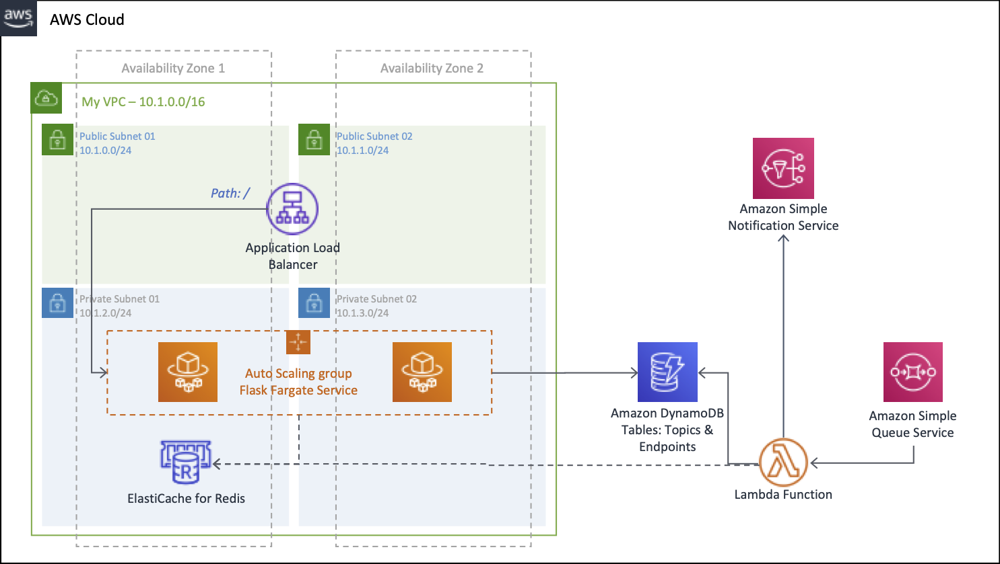

# Amazon SNS architecture reference with CDK

This project contains source code and supporting files for a serverless application that you can deploy with CDK.



## Requirements for development environment

Work inside your AWS Cloud9 environment - [Create an EC2 Environment](https://docs.aws.amazon.com/cloud9/latest/user-guide/create-environment-main.html#create-environment-console)


Install the latest version of CDK.

``` bash
npm install -g aws-cdk --force
```

Install the Amazon ECS CLI, will be used to push the image docker to an Amazon ECR repository with the ecs-cli push command.

``` bash
sudo curl -o /usr/local/bin/ecs-cli https://amazon-ecs-cli.s3.amazonaws.com/ecs-cli-linux-amd64-latest
sudo chmod +x /usr/local/bin/ecs-cli
ecs-cli --version
```

## Step 1: Create CDK project with Amazon ECR Repository for backend

## Step 2: Create the image container and push to Amazon ECR

## Step 3: Add to the CDK project the remaining services