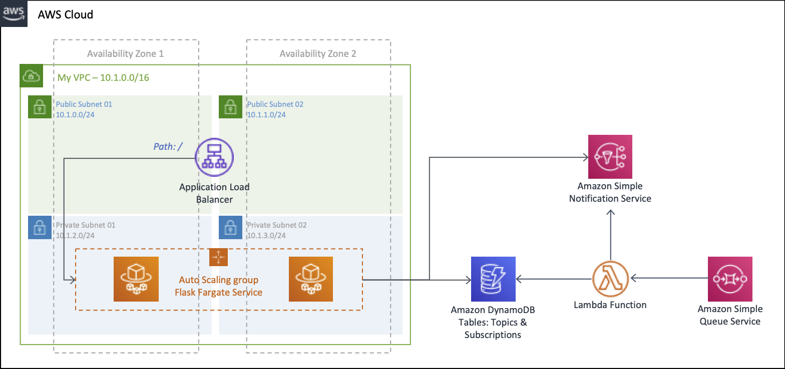

# Amazon SNS architecture reference with CDK

This project contains source code and supporting files for a serverless application that you can deploy with CDK.



## Requirements for development environment

Work inside your AWS Cloud9 environment - [Create an EC2 Environment](https://docs.aws.amazon.com/cloud9/latest/user-guide/create-environment-main.html#create-environment-console)

Install the latest version of CDK.

``` bash
npm install -g aws-cdk --force
```

Install the Amazon ECS CLI, will be used to push the image docker to an Amazon ECR repository with the ecs-cli push command.

``` bash
sudo curl -o /usr/local/bin/ecs-cli https://amazon-ecs-cli.s3.amazonaws.com/ecs-cli-linux-amd64-latest
sudo chmod +x /usr/local/bin/ecs-cli
ecs-cli --version
```

## Step 1: Create CDK project with Amazon ECR Repository for backend


Create a directory for your CDK project.

``` bash
cd ~/environment/
mkdir cdk-sns-messages
```

To initialize your new AWS CDK app use the cdk init command as follows.

``` bash
cd cdk-sns-messages
cdk init --language typescript
```

In **lib/cdk-sns-messages-stack.ts**, replace the comment **"The code that defines your stack goes here"** at the end of the constructor with the code of **Step 1** and add the imports, file reference: [lib/cdk-sns-messages-stack.ts](lib/cdk-sns-messages-stack.ts).

Save it and make sure it builds and creates a stack.

``` bash
npm run build
cdk synth
```

Deploy the stack.

``` bash
cdk deploy
```

## Step 2: Create the image container and push to Amazon ECR

Create folder for container project.

``` bash
cd ~/environment/cdk-sns-messages/
mkdir backend-app
cd backend-app
```

Create the following files inside the filder with the samples codes linked.
- [backend-app/app.py](backend-app/app.py)
- [backend-app/Dockerfile](backend-app/Dockerfile)
- [backend-app/requirements.txt](backend-app/requirements.txt)

Build the docker image.

``` bash
docker build -t backend-app .
```

Test you Flask application inside Cloud9 environment, **use the following command only after step 4 is completed using the table names from the output**.

``` bash
docker run -p 8080:5000 \
-e AWS_ACCESS_KEY_ID=xyz \
-e AWS_SECRET_ACCESS_KEY=xyz \
-e AWS_DEFAULT_REGION=us-east-1 \
-e TOPICS_TABLE_NAME=topics_table_name \
-e SUBSCRIPTIONS_TABLE_NAME=subscriptions_table_name \
backend-app
```

Push the docker image to Amazon Elastic Container Registry created previously.

``` bash
ecs-cli push backend-app
```

## Step 3: Create the lambda function in your local project

Create folder for container project.

``` bash
cd ~/environment/cdk-sns-messages/
mkdir lambda
cd lambda
```

Create the following files inside the filder with the samples codes linked.
- [lambda/app.py](lambda/app.py)
- [lambda/requirements.txt](lambda/requirements.txt)

## Step 4: Add to the CDK project the remaining services

In **lib/cdk-sns-messages-stack.ts**, add the code of **Step 3** from [lib/cdk-sns-messages-stack.ts](lib/cdk-sns-messages-stack.ts).

Save it and make sure it builds and creates a stack.

``` bash
cd ~/environment/cdk-sns-messages/
npm run build
cdk synth
```

Deploy the stack.

``` bash
cdk deploy
```